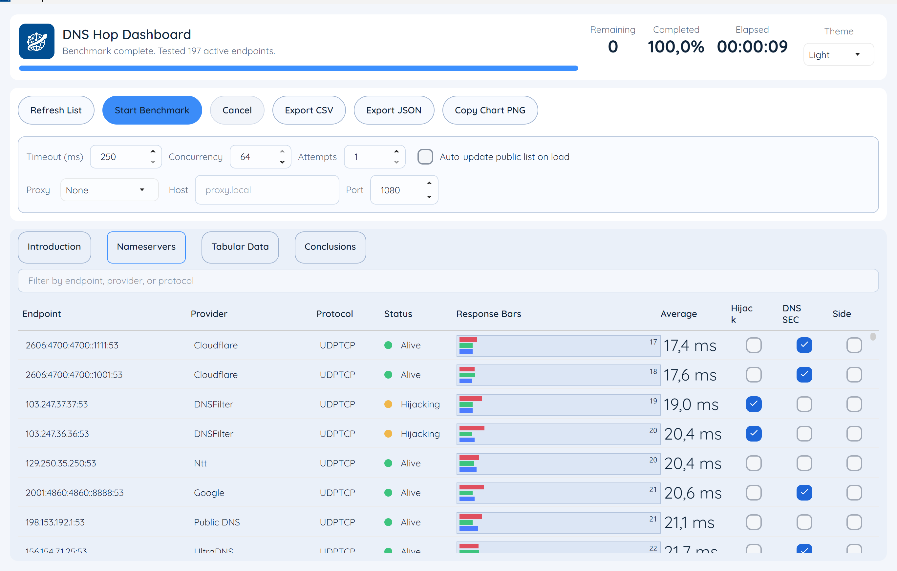

# DNSHop

Modern DNS benchmarking utility (GRC-inspired) built with C# 12, .NET 8, Avalonia, SukiUI, and MVVM.

## Screenshot



## Phase 1 - Setup and MVVM scaffold

```powershell
# From repository root
New-Item -ItemType Directory -Path DNSHop -Force
cd DNSHop

dotnet new sln -n DNSHop

dotnet new avalonia.mvvm -n DNSHop.App -o src/DNSHop.App

dotnet sln DNSHop.sln add src/DNSHop.App/DNSHop.App.csproj

dotnet add src/DNSHop.App/DNSHop.App.csproj package SukiUI
dotnet add src/DNSHop.App/DNSHop.App.csproj package DnsClient
dotnet add src/DNSHop.App/DNSHop.App.csproj package CsvHelper
dotnet add src/DNSHop.App/DNSHop.App.csproj package Avalonia.Controls.DataGrid
```

Scaffolded MVVM core:

- `src/DNSHop.App/ViewModels/MainWindowViewModel.cs`
- `src/DNSHop.App/ViewModels/DnsServerResultViewModel.cs`
- `src/DNSHop.App/Models/*.cs`
- `src/DNSHop.App/Views/MainWindow.axaml`

## Phase 2 - DNS benchmarking engine

Core benchmarking service:

- `src/DNSHop.App/Services/DnsBenchmarkService.cs`

Features implemented:

- Concurrent benchmarking with `Task.WhenAll` + `SemaphoreSlim` concurrency cap.
- Cached probe: `google.com`.
- Uncached probe: randomized `Guid.com`.
- DotCom probe: `com` NS.
- Reliability probes:
  - Redirecting/NXDOMAIN hijack check: randomized `.invalid` query.
  - DNSSEC validation check: `dnssec-failed.org` (SERVFAIL expected for validating resolvers).
- Protocol support:
  - Standard UDP/TCP DNS via `DnsClient.NET`.
  - DoH via RFC 8484 wire-format POST.
  - DoT via TLS-wrapped DNS with length-prefixed wire format.

## Phase 3 - Avalonia + SukiUI UI/UX

Main shell:

- `src/DNSHop.App/Views/MainWindow.axaml` using `SukiWindow`.
- `src/DNSHop.App/App.axaml` with `SukiTheme` for light/dark theme switching.

Views included:

- Introduction
- Nameservers (main DataGrid + context menu)
- Tabular Data
- Conclusions

UI features:

- Dashboard with queries remaining, completion %, elapsed time.
- Filterable/sortable nameserver list.
- Context-menu actions:
  - Remove / Sideline / Pin to Top
  - Remove Dead / Non-DNSSEC / Redirecting
  - Copy IP
  - Sort by Best / Cached / Uncached
- Custom response-time visual bars:
  - `src/DNSHop.App/Controls/ResponseBarsControl.cs`

## Phase 4 - Export and installer packaging

Export services:

- `src/DNSHop.App/Services/ExportService.cs`

Supported exports:

- CSV
- JSON
- PNG chart snapshot copied to clipboard

Installer assets:

- `installer/DNSHop.iss`
- `publish-win-x64.ps1`

### Publish command

```powershell
dotnet publish src/DNSHop.App/DNSHop.App.csproj `
  -c Release `
  -r win-x64 `
  --self-contained true `
  /p:PublishSingleFile=true `
  /p:PublishTrimmed=true `
  /p:TrimMode=partial `
  /p:IncludeNativeLibrariesForSelfExtract=true `
  -o artifacts/publish-win-x64
```

### Build + run locally

```powershell
dotnet restore
dotnet build DNSHop.sln
dotnet run --project src/DNSHop.App/DNSHop.App.csproj
```

## Notes

- On startup, the app can merge built-in resolvers with a public list feed.
- Export files are written to: `Documents\DNSHop\Exports`.

