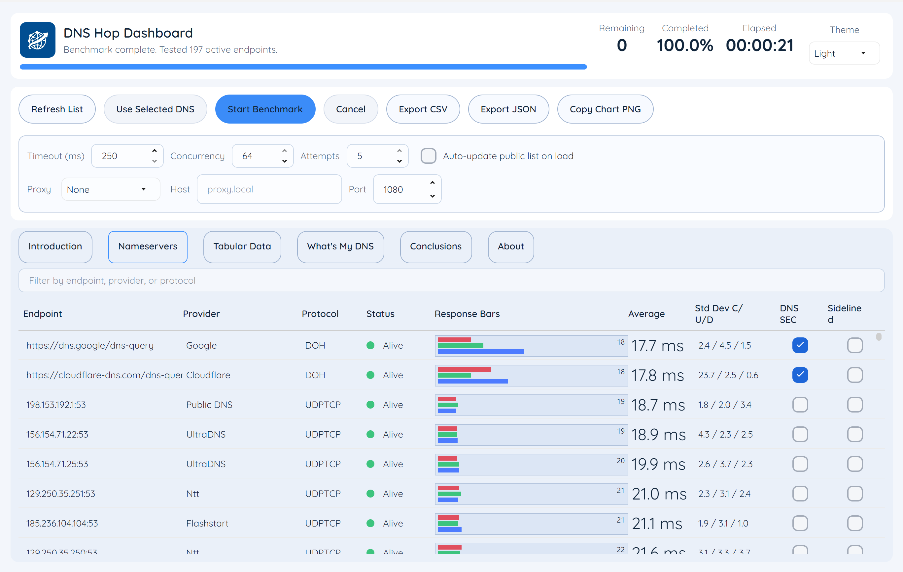

# DNS Hop

<div align="center">
  
</div>

<div align="center">
  <a href="docs/images/dns-hop-dashboard.png">
    
  </a>
</div>

<div align="center">
  <a href="https://github.com/center2055/DNS-Hop/releases/download/v1.0.0/DNS-Hop-Setup-v1.0.0.exe">
    
  </a>
  <a href="https://github.com/center2055/DNS-Hop/releases/latest">
    
  </a>
</div>

DNS Hop is a fast Windows DNS benchmark and switching tool for people who want clear numbers, one-click system changes, and no paywall for basic resolver testing.

## Why this exists

DNS switching and benchmarking are simple utilities. They should not be locked behind a $10 upsell just to compare resolvers and apply a better one. DNS Hop exists to give that workflow away for free, with a cleaner modern UI and support for both classic and encrypted DNS testing.

## What it does

- Benchmarks classic DNS, DoH, and DoT endpoints.
- Measures cached, uncached, and `.com` lookup latency.
- Flags redirecting resolvers, dead servers, and DNSSEC support.
- Lets you filter, pin, sideline, export, and compare endpoints quickly.
- Applies the selected classic DNS resolver to your active Windows adapters with one click.
- Supports light and dark mode with the same dashboard workflow.

## One-click switching

- Select a resolver in the `Nameservers` or `Tabular Data` grid.
- Click `Use Selected DNS`.
- Windows will prompt for elevation only when the DNS change is applied.

Current limitation:

- System DNS switching currently applies classic UDP/TCP DNS endpoints on port `53`.
- DoH and DoT entries are still benchmarked and compared, but they are not pushed into Windows network adapter settings by this button.

## Stack

- C# 12
- .NET 8
- Avalonia UI
- SukiUI
- MVVM Community Toolkit
- DnsClient.NET

## Local build

```powershell
dotnet restore
dotnet build DNSHop.sln -c Release
dotnet run --project src/DNSHop.App/DNSHop.App.csproj
```

## Publish EXE

```powershell
./publish-win-x64.ps1
```

Output:

- `artifacts/publish-win-x64/DNSHop.App.exe`

## Notes

- Exported files are written to `Documents\\DNSHop\\Exports`.
- On startup, DNS Hop can merge the bundled resolver list with the public feed.
