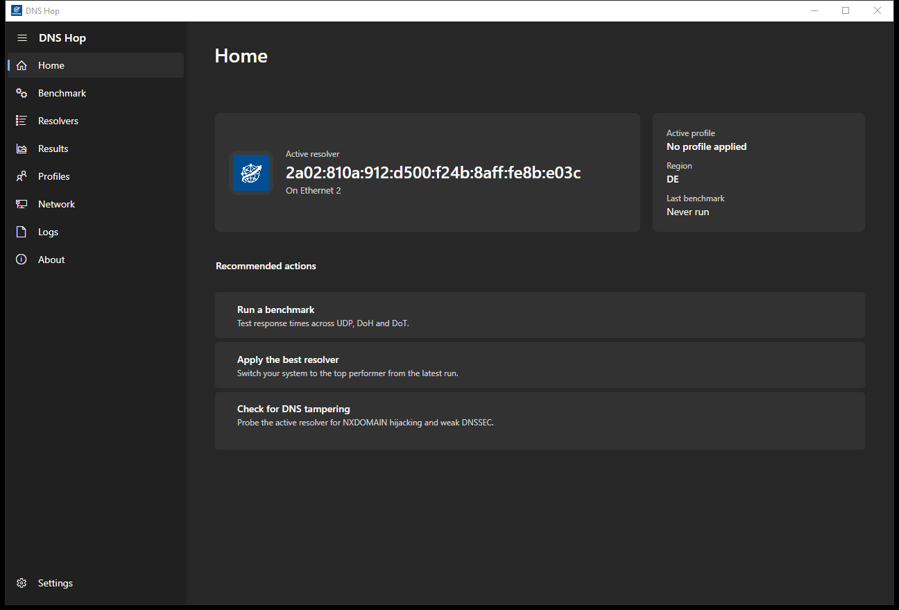

# DNS Hop

Modern DNS benchmark and resolver-switcher for Windows and Linux. Built with C#, .NET 8 and Avalonia + FluentAvalonia.



## What it does

DNS Hop helps you pick a fast, honest DNS resolver and apply it to your system without leaving the app.

- Benchmarks public resolvers across classic UDP/TCP, DoH and DoT
- Surfaces three timing probes (cached, uncached, DotCom) plus reliability checks for DNSSEC, NXDOMAIN hijacking and dead servers
- Applies the resolver you pick directly to the active system adapter on Windows or Linux
- Verifies what actually went through with a DNS leak test
- Speaks five languages out of the box

## v2 highlights

The whole shell was redesigned in v2 around the Windows 11 25H2 Settings aesthetic:

- **FluentAvalonia `NavigationView`** with a left rail: Home, Benchmark, Resolvers, Results, Profiles, Network, Logs, Settings, About
- **Mica backdrop** on Windows 11 when you stay on the System theme; solid backgrounds in Light/Dark so the title bar and sidebar match the rest of the UI
- **DNS Profiles** — save preferred + alternate pairs for IPv4 + IPv6 and apply with one click. Built-in profiles: Cloudflare Privacy, Quad9 Secure, AdGuard Family, Mullvad, Google
- **Geo-aware recommendations** that bias the resolver list toward your region (Cloudflare CDN trace, country-only, six-hour cache, no precise geolocation)
- **Curated resolver metadata** — operator, country, no-log policy, ad/malware/adult filtering surfaced as badges
- **DNS leak test** via `whoami.cloudflare` so you can verify your active resolver
- **Apply history** keeps the last five applied configurations with a one-click "Restore previous"
- **Results page** with two recommendation cards (Primary / Secondary) and per-row latency bars
- **Logs page** with severity colours, level filters, search and export
- **Five languages** out of the box (English, German, French, Russian, Simplified Chinese) with reactive switching — no restart

## Get it

Latest release: <https://github.com/center2055/DNS-Hop/releases/latest>

Each release ships:

| Asset | Platform |
| --- | --- |
| `DNS-Hop-Setup-vX.Y.exe` | Windows installer |
| `DNS-Hop-Portable-vX.Y.zip` | Windows portable |
| `DNS-Hop-AppImage-vX.Y-x86_64.AppImage` | Linux AppImage |

## Build from source

Requires the .NET 8 SDK.

```bash
dotnet restore
dotnet build DNSHop.sln
dotnet run --project src/DNSHop.App/DNSHop.App.csproj
```

### Self-contained Windows release

```powershell
dotnet publish src/DNSHop.App/DNSHop.App.csproj `
  -c Release `
  -r win-x64 `
  --self-contained true `
  /p:PublishSingleFile=true `
  /p:IncludeNativeLibrariesForSelfExtract=true `
  -o artifacts/publish-win-x64-release

# portable zip
.\scripts\package-win-portable.ps1 -PublishDir artifacts\publish-win-x64-release -ProjectPath src\DNSHop.App\DNSHop.App.csproj

# installer (Inno Setup 6)
& "C:\Path\To\Inno Setup 6\ISCC.exe" installer\DNSHop.iss
```

### Self-contained Linux AppImage

```bash
./scripts/publish-linux-appimage.sh
# Produces artifacts/DNSHop-linux-x86_64.AppImage
```

The Linux AppImage is also built by CI on every push to `main` and attached to GitHub Releases on every `v*` tag — see [`.github/workflows/linux-appimage.yml`](.github/workflows/linux-appimage.yml). The matrix smoke-tests the bundled binary on Debian 12, Fedora 41 and Arch using `DNSHop.App --smoke-test`.

## Project layout

```
src/DNSHop.App/
├── App.axaml(.cs)             FluentAvalonia bootstrap + DI
├── Program.cs                 Entry point, command-line dispatch
├── Localization/              i18n service, markup extension
├── Models/                    DnsServerDefinition, DnsProfile, etc.
├── Services/                  Benchmark, ServerList, SystemDns, Profiles, LeakTest, Geo, Metadata
├── Styles/                    Theme + card styles
├── ViewModels/
│   ├── ShellViewModel.cs      Navigation rail + active page
│   └── Pages/                 One VM per nav item
├── Views/
│   ├── ShellWindow.axaml      Main window (NavigationView + Mica)
│   └── Pages/                 One view per nav item
└── Assets/
    ├── i18n/                  Per-culture JSON dictionaries
    └── resolver-metadata.json Curated operator / region / no-log info
```

## System DNS switching

- **Windows**: classic UDP/TCP IPv4 + IPv6 endpoints on port 53. Profiles apply preferred + alternate via `netsh`.
- **Linux**: tries NetworkManager (`nmcli`) and `systemd-resolved` first; falls back to writing `/etc/resolv.conf`.
- **WSL**: writes `/etc/resolv.conf`. For changes to survive a restart, set `[network] generateResolvConf=false` in `/etc/wsl.conf`. WSLg is required for the GUI.

## Diagnostics

- Logs are written to `%LOCALAPPDATA%\DNS Hop\Logs` on Windows and `$HOME/.local/share/DNS Hop/Logs` on Linux.
- The in-app Logs page parses these with severity colouring and supports filter + export.
- `DNSHop.App --smoke-test` runs a quick non-UI sanity pass and prints version, platform and the active diagnostics log path. This is what the CI matrix uses.

## Notes

- Custom resolver entries you add in **Resolvers** persist in `settings.json` under `%LOCALAPPDATA%\DNS Hop\`.
- The "Update public list on launch" option pulls a small additional set of resolvers from <https://public-dns.info>. Turn it off if you only want the curated built-in list.
- Exports land in `Documents\DNSHop\Exports`.
- Translations live in `src/DNSHop.App/Assets/i18n/<culture>.json`. PRs adding more languages are welcome.
